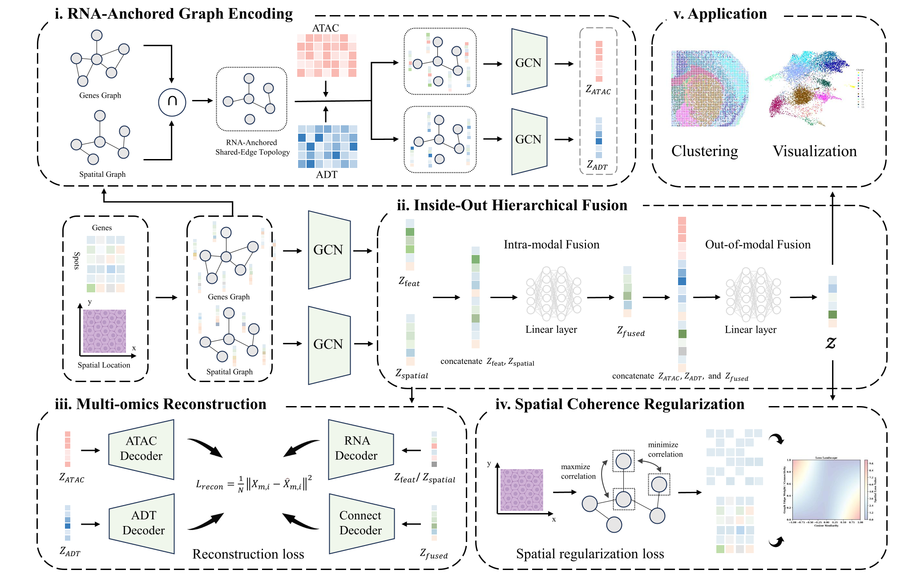

# ARISE
# ARISE: RNA-Anchored Shared-Edge Topology and Hierarchical Fusion for Scalable Spatial Multi-Omics Integration

<p align="center">
  
  
  
  
</p>

<p align="center">
  <b>A</b>nchored <b>R</b>NA for <b>I</b>ntegrated <b>S</b>patial <b>E</b>mbedding
</p>

---

## Overview

**ARISE** is an RNA-anchored framework for spatial multi-omics integration. Rather than constructing independent modality-specific graphs, ARISE defines a **shared-edge topology** by intersecting an RNA feature-similarity graph with a spatial-proximity graph, retaining only edges supported by both transcriptional similarity and physical adjacency. Auxiliary modalities (ADT, ATAC, histone modifications) are encoded on this common scaffold, and an **inside-out hierarchical fusion** module integrates them into a unified latent representation.

<p align="center">
  
  <br>
</p>

**Key advantages:**
- Theoretically grounded: graph intersection minimizes false-positive edges across all k-of-r fusion rules (Theorems 1–3)
- Stable under perturbation: GNN encoder drift is provably linear in graph perturbation magnitude (Theorem 4)
- Modular: additional modalities can be incorporated without redefining the shared-edge topology
- Supports bi-modal (RNA+ADT, RNA+ATAC) and tri-modal (RNA+ATAC+Protein/Histone) settings

---

## Installation

### Requirements

- Python >= 3.8
- PyTorch >= 1.12
- CUDA (recommended)

### Dependencies

```
torch>=1.12.0
torch-geometric
scanpy>=1.9.0
anndata>=0.8.0
numpy
scipy
pandas
scikit-learn
matplotlib
seaborn
```
## Setup
```bash
git clone https://github.com/XiangxiangWang-code/ARISE.git
```
---

## Data Preparation

ARISE accepts input in [AnnData](https://anndata.readthedocs.io/) `.h5ad` format. Each modality should be stored as a separate AnnData object with spatial coordinates in `adata.obsm['spatial']`.

### Datasets Used in the Paper

| Dataset | Modalities | Spots | Source |
|---|---|---|---|
| Human Lymph Node (HLN) | RNA + ADT | 3,484 | [Long et al., 2024](https://www.nature.com/articles/s41592-024-02313-7) |
| Mouse Brain (P22) | RNA + ATAC | 9,215 | [Zhang et al., 2023](https://www.nature.com/articles/s41586-023-05795-1) |
| Mouse Thymus | RNA + ADT | 4,697 | [Liao et al., 2023](https://www.biorxiv.org/content/10.1101/2023.04.26.538404) |
| Mouse Embryo E13 | RNA + ATAC | 2,187 | [Zhang et al., 2023](https://www.nature.com/articles/s41586-023-05795-1) |
| Mouse Embryo (Spatial-Mux-seq) | RNA + ATAC + Protein | 10,000 | [Guo et al., 2024](https://doi.org/10.1101/2024.09.19.39345645) |
| Mouse Embryo (H3K27ac/H3K4me3/H3K27me3) | RNA + Histone | ~2,500–10,000 | [Guo et al., 2024](https://doi.org/10.1101/2024.09.19.39345645) |

### Data Format

```python
import anndata as ad

# RNA modality
adata_rna = ad.read_h5ad("rna.h5ad")         # shape: (n_spots, n_genes)

# Auxiliary modality (ADT or ATAC)
adata_adt = ad.read_h5ad("adt.h5ad")         # shape: (n_spots, n_proteins)

# Spatial coordinates must be stored in obsm
# adata_rna.obsm['spatial'] — shape: (n_spots, 2)
```

---

## Reproducing Paper Results

Training scripts are located in `ARISE/code/`.

### RNA + ADT: Human Lymph Node
```bash
python ARISE/code/HLN.py
```

---

## Contact

For questions or issues, please open a GitHub Issue or contact:

- Yunhe Wang: wangyh082@hebut.edu.cn  
- Xiangtao Li: lixt314@jlu.edu.cn
